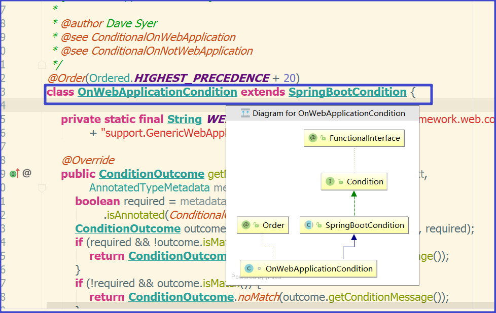
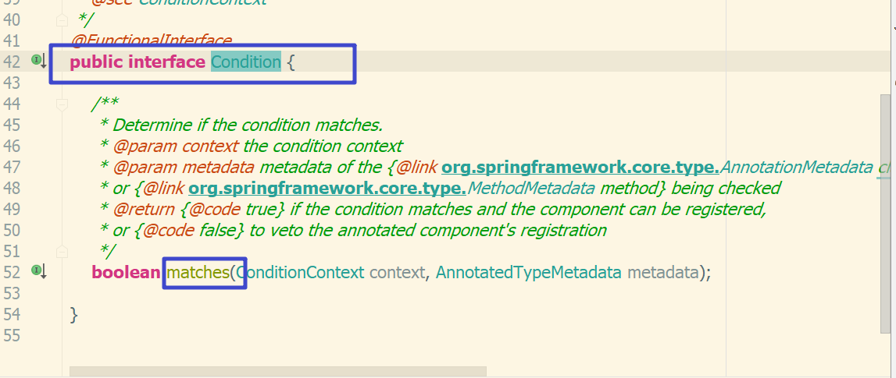
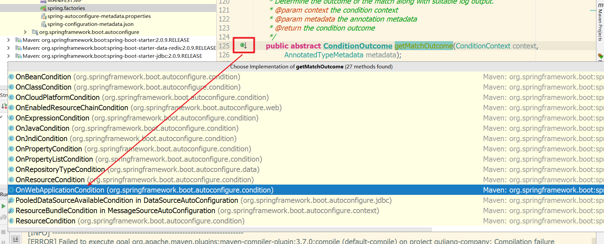
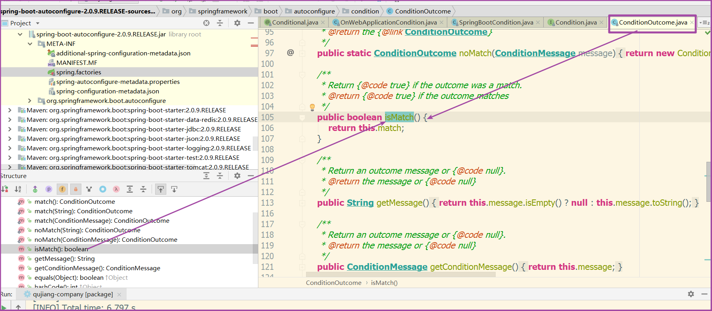
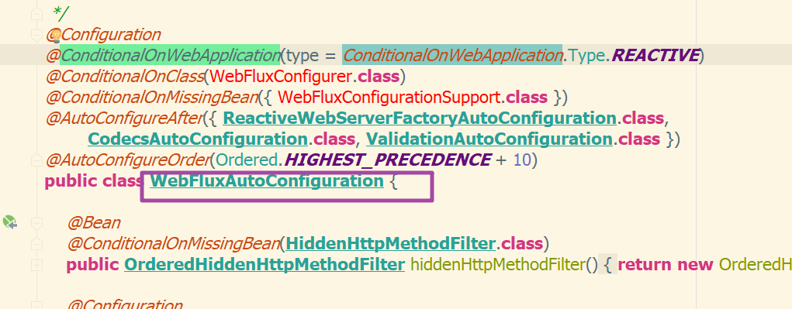
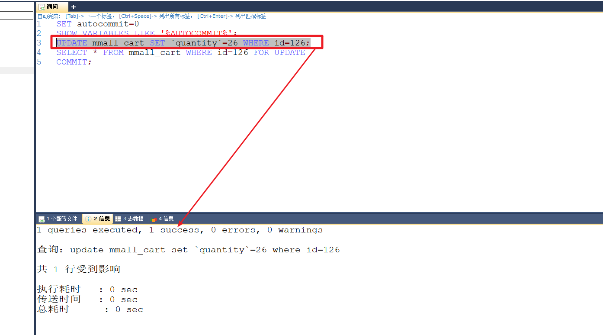

# 超级账本计划
属于自己的"超级账本仓库",因为以前记笔记是分了很多文件去记录的,这就导致无法使用全文检索,去找到我记录的知识点,所以准备尝试,将所有笔记代码记录在一起,可以快速定位到笔记内容,从而解决问题!

本次账本记录与后端一切相关知识!

切记因为笔记可能会变得十分臃肿,所以一定要分好类!分类原则秉承着,宁愿多分,也不要少分的原则。一级标题与二级标题都属于大分类,按照分类标准来写,三级分类属于小标题,按照时间来写。三级标题格式为 内容 2019年8月23日 12:07:19这种形式

# Java基础语法相关

> 本分类包含内容:
>
> 1. JDK内置api(如时间localdate api)
> 2. java基础语法(如lambda)

## 注解的使用

首先我们需要明确,注解本身是没有任何功能的,就和xml一样。注解和xml都是元数据的一种。元数据即描述数据的数据,这就是所谓的配置。注解的功能来自用这个注解的地方。在原始的使用中,我们可以通过反射来获取当前方法标注的注解内容,然后根据注解的内容决定方法是否执行,方法执行时是否真的调用,方法执行时是否需要某些特殊处理,这一点在于原生aop编程测试时,非常明显!

# 编程思路

> 1. 实现特定功能的思路(一般是非服务端开发的功能思路,服务端开发的思路放在JavaEE相关模块下面)
> 2. 对一些词汇的理解
> 3. 一句话概括某项变成事物
> 4. 为什么会出现某种编程现象的理解(比如为什么要使用分布式,读写分离)

## 如何看待工具类呢

其实与框架是一样的,工具类的出现一定是简化了我们的工作量,我们要付出的仅仅是学习成本!就比如阿帕奇的IO工具类,虽然学习成本有那么一点点,但是学会了,写出的代码,性能好,逼格高,安全,还简单,让我们编程更加快乐!在学习的时候不要视图把所有框架的底层源码搞清楚,这是不现实的,我们要做的是专精,根据工作或自身的需要看懂一个框架就很好了,**不要拿到一个东西,先想着能不能搞清楚源码,这种思路是不对的,应该想着怎么解决现在的痛点,解决痛点后如果项目需要将源码搞清楚,再进行深扒!!!**

##如何看懂开源或维护web项目

首先当我们看别人代码觉得很复杂的时候,那是因为我们能看的项目一般已经维护了很久,已经抽取了无数次,所以代码不好理解!

在我们看开源项目的时候,一定要找到一个入口,这里的入口不是项目启动的入口,而是根据http请求或接口调用的API来确定入口,然后一条路拔下去。

具体的套路为:

1. 当时一个web项目时
   1. 先根据web页面找到发送的请求
   2. 在后端项目中找到接收本次请求的controller
   3. 通过这个controller入口,结合自身学习的大量知识,以及代码的堆栈调用一点一点的研究
2. 当是一个框架时
   1. 通过api的调用找到某个类
   2. 找到的这个类就是一个入口
   3. 通过这个入口,以及自身学习的大量相关知识根据堆栈调用研究下去!

可以看出以上寻找入口后成功后,都需要研究堆栈调用,这种情况下,我们就需要下载源码,通过在源码寻找入口以及打断点进行堆栈调用!**因为在我们通过maven导入jar包其实是编译后的文件,我们没办法通过搜索快速定位到入口!**

通过以上总结,其实controller只是用来做调用的,controller会调用service层的代码,所以我们重点关注的是service层的代码!

如上图开源代码所示,controller只是调用AdminService,但是在AdminService中会调用其他service的代码,这也应该是我们写代码时需要注意的点!**业务代码只能一句一句的去看,硬着头皮去调试!任何人都是这么过来的,只是有人坚持下来了,有人放弃了!**


Service只会调用自己的Dao层以及,别的Service层代码,绝对不要去调用别的Dao层代码,否则复用性几乎为0。

##为什么要叫枚举类呢?

这个问题困扰了我很久,现在就要揭晓啦!

其实我一开始想的并没有错,要理解枚举类,就要从枚举这个词出发。枚举,顾名思义就是数的清的东西。那么枚举类中我们是要数的清什么呢?对的就是枚举类的实例化对象。

枚举类与普通类最大的区别是,普通类的实例化对象时不可枚举的!而枚举类的实例化是可枚举的,讲人话的意思就是,普通类可以实例化无限多个对象,而枚举类能实例化的对象是有限的个数,别抬杠啊,除非你想去工地干活。

枚举类的对象不仅是可枚举的,并且枚举类对象实例化的代码就在枚举类中。定义一个标准的枚举类格式如下:

```java
public eum MainEum{
    AAA("张三");
    private string text;
    //省略getter与setter
    private MainEum(string UpText){
        this.text = UpText;
    }
}
```

## 锁机制

所有的锁其核心都是为了控制并发访问。锁最终实现的是在同一个时刻下,只有一个线程对某项资源进行访问。即将并行访问,变成一个串行化的访问模式。

无论是数据库还是程序中,锁都可以分为悲观锁和乐观锁,这是锁的两种理念。悲观锁由于在访问前会锁定资源,导致别的访问该资源的线程处于阻塞状态,所以悲观锁的性能并发性能不高。乐观锁通过结果集的版本号字段,在提交修改时才对数据进行校验,如果版本号不一直,那就说明数据不对,然后将具体的后续处理交友设计人员来设计。乐观锁由于不会对数据先进行上锁再修改,所以当前数据在并发访问的情况下,就不会阻塞别的线程访问该资源,所以并发性能更高。

## 元数据的含义

在spring框架中,无论是xml配置,注解配置,都被称为配置元数据,所谓元数据即描述数据的数据。元数据本身不具备任何可执行的能力,只能通过外界代码来对这些元数据解析后进行一些有意义的操作。spring容器解析这些配置元数据进行bean的初始化、配置和管理依赖。比如生命bean的配置:@Component、@Service等。注入bean的注解:@Autowried等,都属于元数据。

## 追踪@ConditionalOnWebApplication源码的一点感悟

首先我在看到这个注解的时候,发现他是一个组合注解,被这个注解标注的bean是否加载,本质上是由@Condition来决定的,于是理所当然的我就点击进去OnWebApplicationCondition,希望能找到matches方法,但是点击进去后发现当前类并没有matches方法(这里已经展示了UML类图),**我们需要先找到实现matches方法的地方,因为当前注解需要的类如下**@Condition注解追中需要的类型是Condition,所以该注解在运行的时候,只能通过向上转型的方式调用到(因为他也跟不知道子类有啥别的方法,当然也无法进行调用)Condition接口类型的matches方法。回到OnWebApplicationCondition类继续向上跟,找到matches方法,因为只有这个方法最终被调用,一切的逻辑落脚掉都是这个方法,只要找到这个方法就好办了,根据子类没有就在父类中找的原则我们找到这个类发现他就是实现了Condition接口的matches方法,我们就继续跟这个方法,先从return看我们发现返回boolean是通过这个类的isMatch方法来实现的,那就先看看怎么获取的这个类,点击getMatchOutcome方法,发现在当前类中getMatchOutcome方法是一个抽象方法,那肯定在子类中有他的实现这时候我们就需要跟这个方法的实现了,因为我们现在跟的是webCondition,找到他的实现类顺利的找到这个方法了,依旧是先看方法的return部分我们发现ConditionOutcome.match(...)是一个工厂方法,用于创建ConditionOutcome的实例对象,在该对象中我们可以发现与此事再回头看就显得很清楚了,逻辑就是通过判断构造一个ConditionOutcome对象实例,这个对象实例调用isMatch()就会返回是否匹配成功的布尔值,从而实现根据条件注入当前标注举个例子,就是下图中的WebFluxAutoConfiguration这个bean是否会被加入到ioc容器中。记住组合注解仅仅就是将几个注解的功能进行组合,而不会改变功能本身,所以ConditionalOnWebApplication并不会改变@Conditional注解的作用@Conditional如果调用matches返回false的话,这个bean就是不会被加载入IOC容器中的!

## 关于maven的web项目结构一点感悟

我们在搭建maven结构的项目时,一定要严格遵守maven的规范,如果不遵守maven的规范,那么项目时不可能正常运行的!所以今天我们就来说一说,问什么严格遵守maven规范,就能够正常运行一个项目。

首先想要运行maven结构项目的前提是我们在电脑上安装了maven,这样子我们才能通过安装的maven去读取我们的项目,因为maven软件在读取项目进行编译打包的时候,就会根据maven软件预设的一些文件名进行加载,如果加载错误当然就不能正常的运行!

同理我们在创建一个maven的web项目时,也需要按照maven的要求来,这就是maven软件规定的,没什么道理,就算找到为什么要叫pom.xml之类的,也是对开发没什么实质性的帮助。对于软件的使用记住就好了!

综上,创建一个基于maven结构的web项目,我们需要知道的就是严格按照maven的规范来,maven就是将webapp以及各个目录按照一定的组织形式打成一个war包,那我们就得按照maven的来,这是没什么深刻道理的。**再次强调,对于软件的使用,只要知道套路就是最低也是最高的要求了而maven显然就是一个软件!**我们对于"软件"的理解不要太狭隘,准确的说,辅助或促使我们工作的应用都可以称为一个软件,而不是点击下一步下一步安装的才叫软件啊!!!

在maven的web项目中,对的配置就是对tomcat的配置也就是我们在没有用ide的时候通过这个文件进行的配置。

而maven结构的src/webapp/WEB-INF/web.xml就是对tomcat中每个webapp独有的那个web.xml的配置,这点我们可以重复听听方立勋的课程,会有更清晰的理解!

##编码是在干什么

总体而言编码的意思就是：根据字节数组对照码表，**将字节数组编成码表中对应的字符**。所以编码后返回的是字符或字符串

一个字节数组包含很多字节，而一个字节有8位，所以每个字节数组都能用一个数字来表示，比如01010111。这样的话，根据对应字符集的查找规则（1个字节查找法，2个字节查找发，3个字节查找法等等），就可以在码表中查询到唯一的字符串。所以，在我们进行编码的时候，一定会将字节按照某个码表编成字符串。更深一层这也就是乱码产生的原因，比如:原本的字符串是用a码表进行字符数组的获取(通过字符串获取字符数组)，但是用b码表进行编码(将字符数组编写成字符串)，这样子数据肯定就乱了，甚至超越了当前码表能表示的范围，造成数据错乱。但是如果两个码表有重叠的部分，那么数据有可能幸运的就一样的,不过我们应该知道，这还是“错误”数据！

## BASE64编码

base64编码，就是通过将数据降维，将三个字节的数据放在四个字节中，缺省的位用0补全，从而保证查询base64码表的时候，数据变成键盘上可以看到的字符，从而防止产生特殊字符，导致数据传输出现问题,因为数据在传输的过程中总有一个开始符号和一个结束符号,如果不进行BASE64编码的话,万一传输的数据中出现结束符号,那就会导致数据传输提前结束,数据不完整。

图示,将3个字节通过BASE64编码规范转换为4个字节的情况

其实本质上就是平均将3个字节,3\*8=24位,平均放到4\*8=32位中,没有的位直接补0。从而将字符的范围缩小到0000000到00111111,之间一共是2的6次方个数字,所以BASE64码表也应该有64个符号,码表如下


从侧面说明我们的猜想是正确的!

#服务层

##JavaEE相关

> 1. servlet相关知识(如原生拦截器实现跨域访问,session相关知识等) 
> 2. web服务器开发的一些特定场景的思路,比如如何实现后端表单防止重复提交等

###用户登录

处理用户登录的思路为，系统校验成功用户的登录名以及密码后，将用户名对应的用户数据存放在内存空间中，以K-V键值对的形式进行保存。比如在javaEE中，用户登陆成功会创建一个session空间，这个session空间也是一个K-V键值对的形式，K就是字符串JSESSIONID，V是一个map。登陆成功后我们将对用SESSION空间的字符串写回浏览器的cookie中，然后浏览器在访问该域名的时候，就会自动带上相对应的cookie，我们在服务端校验cookie是否有效（即这个cookie能不能从session集合中取出一个session对象，并且这个session对象中有保存用户登陆成功后的信息），如果能够校验成功，那就代表着用户是登陆状态。这就是无状态的http协议，保存用户登录的套路。

这里值得一提的是，**用户的会话保持，并不意味着用户就得登录**，登陆成功后会向session空间中存储一个用户信息的K-V键值对，但是如果没有登录，这个session空间还是存在的，对用的就是目前操作的客户端浏览器，**要把会话保持跟用户登录进行区分**，只要有会话保持我们就能做很多事情，比如一次性验证码，比如后端防止用户重复提交，等等。

## 服务端防止表单重复提交的时序图


## 记住我功能实现

以下为记住我功能实现


注意,记住我功能的实现,是存在第一次登录与第二次登录的情况的,首次登录勾选记住我,然后回写用户名密码到客户端的cookie。

**判断是否携带登录信息的逻辑应该写在过滤器中!**

##spring相关

> 1. 这里主要是spring框架相关知识(如aop 如何在springboot上使用等)

###关于上下文、容器、环境的理解

一直被这几个概念搞糊涂,现在尝试着理解一下

首先可以这么说吧


根据有道的翻译,我们可以先知道,上下文与环境其实是一个意思。所以我们的spring上下文与spring运行环境也是同一个东西。

当我们看到context结尾的类时直接想到运行环境就没错了。

我们为什么在使用大部分框架的时候都需要初始化运行环境(上下文)。

举一个栗子吧。

比如我现在租的小房子就是我的生活环境,说成是我生活的运行环境也肯定是没错的。我洗脸需要洗面奶,那我就从我的生活环境中拿到洗面奶就可以了。我想要睡觉那就在生活环境中获取到床,然后我调用自己的睡觉方法,把床作为参数传递进去就可以了。简单地说,我在生活中需要的各种东西,从我的生活环境房子中去取得就行了。换一个更加程序的说法就是,**我在运行的时候,需要的一些对象,直接从我生活的运行环境中取得就可以了。**

听过上面的例子,那我们对spring运行环境或者上下文就能有一个较为清晰的理解了。spring的应用环境作用与我们的生活环境作用没有什么区别。spring在运行的过程中肯定需要使用一些对象来完成很多事情。那spring从哪些地方获取需要的对象呢?就是spring自己的上下文(运行环境)中取得。所以我们对spring上下文或者spring运行环境理解成支撑spring正常运行的各种对象的集合也就没错了。就像我的上下文,其实就是电脑,牙刷,手机,床,空气等等各种对象的组合。如果上下文没能初始好,那么无论是我还是spring都会运行不下去的。所以初始化上下文是非常非常重要的一个环节。

###读取配置文件运行程序的方式

在学习ssm与springboot中,我们有一个明显的感受就是,web.xml文件的消失。在原来的方法中web.xml在启动时,被tomcat读取,并根据相关配置逐行执行。所以我们将spring.xml文件配置到web.xml文件中,就可以随着服务器的启动,而创建出一个spring的ioc容器,从而实现在项目中使用spring的目的。

但是想想,加载spring框架的配置文件的方式只有这一种吗?

显然不是的我们可以不依赖web容器的启动,通过main方法以及spring提供的`new ClassPathXmlApplication("类路径上的配置文件名称")`从而创建一个spring的核心容器。或者通过main方法加载注解类创建核心容器。以上三种方式,本质上都是,创建一个核心容器,该容器里面存有配置文件配置的相关bean。这些在ioc容器中的bean就将生命周期交给了spring去管理。

在springboot中加载spring配置文件的方式,已经被透明化了,但是我们最起码要知道,springboot帮我们完成了配置文件加载这件事(而不能说,springboot没有加载配置文件!),springboot通过包扫描的方式加载配置文件,我们直观的看不到加载配置文件的代码。

可以反过来想想,为什么创建IOC容器一定要加载一个对应的配置文件才行。如果不加载配置文件的话,IOC容器中没有业务bean,如果没有业务组件bean的话,那么就无法使用自动注入功能,无法通过aop对业务组件bean进行横向增强。**这样的IOC容器是毫无意义的容器,所以一定需要加载配置文件,其实就是将业务组件bean加载到IOC容器中,从而使用spring为我们带来的便利!!!**

###突然想通的依赖注入优点

在想要用的时候不用自己new了,如果有修改,直接把配置文件(@Configuration、xml)一修改,不用像老黄牛一样修改每个类出现的地方!!!别看这个问题不大,但是如果你的框架中你自己new了500个类了,然后觉得这个类的构造方法需要改变,如果不是通过依赖注入的方式,那么这个项目基本上是可以放弃了,修改这500个对象因为构造方法的改变带来的错误,就已经让人崩溃了。

其实依赖注入更多的优势是简化框架开发者的开发难度,如果我们在自己的项目中只是使用现成的框架,还真不能感受到依赖注入有多么牛逼。最起码起来注入让我们完全不用搞懂工厂模式了,当然还有很多特点!业界流传的一句话spring让java设计模式消失,可不是一句空话。

##SpringMVC相关

##SpringBoot相关

> 1. springboot相关配置(比如对mvc的配置,对拦截器的配置等)
> 2. springboot源码(比如自动装配原理)
> 3. 一些与springboot集成的方法(比如springboot日志框架的替换或使用)

Spring Boot将功能场景抽取出来，做成一个个的starters（启动器），只需要在项目里面引入这些starter 相关场景的所有依赖都会导入进来。要用什么功能就导入什么场景的启动器

###@ConditionalOnClass为什么飘红还能够执行

首先我们需要读懂这句话

> 摘抄1:
>
> 编译不通过不代表不能运行其字节码。直接跑class文件的时候，如果引用到了其他类，那么类加载器会尝试加载该类，如果在classpath中找不到对应类的class文件，就会报ClassNotFound异常。另外，除了显式的import其他类，还可以通过Class.forName方式加载其他类，这样就可以解决编译不通过的问题了。举个例子的话就是java中sql driver的加载方式： Class.forName("com.mysql.jdbc.Driver");。
>
> 摘抄2:
>
> 首先这些@Configuration类没有被程序中的类引用到
>
> 其次即使引用到这个类，不一定引用到类中的具体某个方法。 查看一下spring类加载器的原码??
>
>  
>
> **虽然这些地方import失败了, 但是不影响.class类加载，**
>
> **也就是说编译这些@Configuration类时依赖的jar是必须存在的，但是运行时这些jar可以不提供**
>
>  
>
> **类加载的时机**：创建该类的实例对象，或者引用了静态方法

以上我们就能理解到,如果在编译的时候将maven的scope设置为support级别,那就会导致编译的时候,有某个jar包,而运行的时候并没有该jar包。如果程序在线上一直没有用到该jar包的话,**那是可以正常运行的**,如果用到了该jar包,就才会报ClassNotFound异常。也就是说如果不进行类加载(创建该类的实例对象，或者引用了静态方法),即使有没有引入的jar包,也不会抛出ClassNotFound这个异常,程序也能正常的执行。以上就为@ConditionalOnClass的现象做出了解释。现在再看看这中源码,是不是就很舒服了!因为飘红的就没有被加载,没被加载程序也就不会使用,所以代码可以完美执行。如果想要用@ConditionOnClass之类的注解,就需要保证在编译的时候,类路径是有该类的,执行的时候有没有无所谓!

###※为什么要使用springboot启动器

还是为了两点:

1. 自动配置(让我们少配置写bean),**这点是尤为重要啊,以前引入一个框架至少需要将框架的某个类加入到核心容器中,加入核心容器的时候,无可避免的要设置很多属性,但是如果使用起步依赖的话,当我们引入starter的时候,就会直接引入相应的bean,我们在使用的时候,直接通过@Autowride就可以在我们的业务中使用框架或类库带给我们的便利了,是不是超爽啊,而且修改配置,因为starter是通过@EnableConfigurationProperties()加载配置类的,因为配置类标有@ConfigurationProperties(prefix="xxx"),所以我们可以在application.yml文件中直接对这个框架进行配置上的修改。**
2. 起步依赖(简化maven的坐标依赖,防止包的版本错乱)

回想起我们自己配置ProcessEngine的场景,如果能引入一个起步依赖然后通过@Autowired直接注入一个合适的ProcessEngine(或各种Service)岂不美哉,又能减少配置,又能防止重复配置可能产生的人为错误,何乐不为呢!

题外话,如果不想魔改activiti的启动器,又想在springboot项目中使用,其实完全可以参考shiro在springboot项目中的使用方式,直接把xml修改成java类的配置方式,然后该注入的注入,该调用的调用就行了。

不使用启动器,肯定也是可以在springboot项目中使用的。只要想办法把activiti中的关键类加入到核心容器中,通过spring管理这些类,完成功能增强(aop、事务等),或是依赖注入就可以了。这样整与springboot起步依赖相比大约有以下缺点:

1. 依赖是我们自己管理的,依赖本身的版本号,或者依赖内部依赖的别的版本号等,我们引入相当于是一个jar包而不会想springboot一样是一个功能。
2. 肯定也是不能直接通过application.yml对我们框架进行设置了(通过属性读取器是可以,但是肯定不方便)

##SpringCloud相关

##服务端开发的一些理论知识

# 关系型数据库及框架

##SQL通用知识

> 1. sql语法
> 2. 调优
> 3. 使用技巧
> 4. 锁的使用

### ※数据表设计思路

定义类别表->定义表->定义对应实体表

在数据库设计中,切记一层一层的寻找对应关系

什么意思呢?

就比如打分定义表与报告表的关系

一个报告包含多个打分指标(非打分指标定义),一个打分指标对应一个分数(一一对应的就可以是一张表)!

而一个打分指标定义对应多个打分指标,此时打分指标这个表就相当于被两个表一对多关联了,所以自然而然的就成了这两个表的中间表!

"xx定义表"的价值就像是一个类,而定义表对应的"实例化表"就相当于一个对象,"xx定义表"的意义在于可以将"实例化表"的一些公有属性进行抽象,并实现配置化的功能。想要配置化,一定要引入定义表。

总结,像是每个页面都会都会出现的内容,其实都可以抽象一个定义表,然后配置化相关内容。甚至是每个循环列表项,每个下拉菜单,都有抽象成一个定义表的可能!

定义表是无状态的,不会存某个用户特有的数据,定义表对应的实例化表才是存特定数据的地方。一般而言,定义表是一对多的一!

像是考卷的试题,就可以有试题定义表,试题定义表的实例化表,就会存,张三的某个试题得了多少分!如果试题业务场景每人只用回答一道题,那大体的设计思路,也是这样的!

---

返过来想一想,如果没有定义表,就以试题为例,业务场景中每个用户需要回答多个试题。

如果我们不存在试题定义表,那么存储的的形式符合三大范式吗?

以张三为例,张三需要存储每个题都需要存储标题等信息,而大量的重复这些不变的信息,我们就需要警觉了。这样的设计就不符合第二范式了。**非主属性完全依赖于主键**。

我们可以参考后边这个文件,让我们对三范式有更加直观的了解[第一、第二、第三范式之间的理解和比较 - 涛声依旧_ - 博客园.pdf](/page/第一、第二、第三范式之间的理解和比较 - 涛声依旧_ - 博客园.pdf)

---

自己做的Excel中,其实应该两个领域对象,两个领域对象的分析,先分析用户题目表,因为用户去做题,然后才会有得分,分析的思路是将用户与题目表该有的所有元素写在同一张表中,然后套3大范式,发现不符合第二范式,修正后形成中间表。

然后,根据业务分析,得分与用于和题目都有关系,所以直接扔到一个与用户和题目都有关系的那张中间表就行了!很简单吧

**模式就是关联两两进行设计(两个表所有信息合在一起就行),然后套3范式,主要是1与2范式,主要是第二范式,消除联合主键,遗忘了就想想本次评价的相关设计套路!**

一个引子,可以参考分析案例

以本次的上传与打分定义为例子。首先一个报告包含多个附件定义,所以将这两个表的字段写在一起,多写两条数据后就会发现联合主键的问题,需要一个中间表。同样的一个报告也包含多个打分定义,依旧存在联合主键的问题,需要中间表,消除联合主键。

最后就是打分定义表与附件上传表,其实根据项目经理提供的"工作底稿"我们将这两个表的字段放在一起后发现会有联合主键的问题,所以依旧需要消除联合主键,引入第三张表。

最后就是打分的分支问题,根据业务场景,分值与报告和打分定义都有关系,毕竟一个确定的分支是由一个确定的报告和报告中某一个确定的打分定义项来的,所以既然都有关系,肯定也是存在中间表中,刚好有一个报告打分中间表,所以自然而然的就存在了"报告-打分定义中间表"中了。

------

上面我们学会了,去设计多对多的表,那如果甄选一对多呢?

很简单还是写在一起,如果发现不同的主键对应相同的某个,或某几个数据列,而这几个数据列的主键是相同的,那就是一对多的关系。

###命名问题

一定不要再命名成 r_id 之类的字段了!!!太坑了,因为自动生成domain的时候,会因为生成setter方法与getter方法导致入库出现问题!!!而且很难排错,所以**解决方案为,不写再图省事写x_id这样的代码了,不光是主键字段!**

在mysql中有很多保留字段,比如desc,一点字段叫作desc就会报sql异常的错误,大体上错误如下:

```sql
'desc,xx,xx)values(?,?,?)'
```

**根据最近的观察,数据库所有表的主键名固定为id,非常合理,编写代码的时候会处理起来思路会很清晰!**

###spring data jpa上的注意点

1. 一定要看报错信息,主要看最后一些报错!因为这几次出问题都是看最后的报错信息才改正的。
2. 在domain中设置集合的时候,一定不要用集合框架的实现类进行接收,需要用List或Set进行接收

###当一个表可能存不同类型的数据时

曲江项目就存在这样一个问题。

我们的报告表本来是存储"曲江评价报告"的,但是业务后期突然让加了一个"公共信用等级评价",这个数据最终因为查询列表的问题,也放在了报告表中

如此一来,我们就需要一个type字段来区分这两张表,等到项目上线的时候,发生了一个意想不到的问题。那就是我们查询"曲江报告用的是字段1",但是老数据的曲江报告type字段为null(毕竟以前没有这个字段么)。这就导致老数据查询出现问题,幸亏数据量不大,把type为null的字段通过where全部修改了!

**但是也为我涨了波教训,以后在设计表的时候,有可能一张表存两种相关的数据时,一定要在一开始就加入type字段,从而保证面对未来的扩展也留有一定的能力!**

###※数据库关联查询注意事项

本次不谈语法,只谈在关系型数据库中,链表查询的注意事项

我们在关联查询的时候,关联条件一般是 a.主键 = b.外键或反过来。

**切记注意不要观察两张表,有一样的字段就直接进行关联查询,因为很有可能这两张表有关联的字段其实根本不能作为多表查询的条件。如果关联条件不正确一定不能查询到我们想要的结果,最好的情况查询结果是null,要不然查询出来的就是脏数据!**

在严格遵守以上条件的情况下,如果存在a.非主键但唯一的字段 = b.主键,或反过来。

这种情况其实就是一对一的查询

如果是a.非主键但唯一的字段 = b.非主键但唯一的字段,且这两个字段是代表同一个东西,比如流程引擎中的businessKey与业务表中的主键,这样子也能作为关联条件进行查询,其实还是一对一,只不过没有明确外键主键关联关系。

###※事务与锁的案例

根据颗粒度数据库锁可以分为行锁与表锁。根据锁的性质可以分为共享锁与排它锁。在执行update、delete、insert的时候会给结果集加上排它锁。select默认是非阻塞的锁,我们也可以手动为select加上共享锁或排它锁。共享锁不会阻塞共享锁,但是会**阻止**排它锁的执行(无法执行成功)。而排它锁会**阻塞(block)**共享锁与排它锁的执行(获取锁之后会继续自动执行)。

根据测试,在同一个事务中,不会出现锁的情况。比如:

1. 首先保证事务的自动提交关闭
2. 执行select语句对当前结果集进行加锁
3. 然后对id=126的数据进行更新
4. 发现更新成功,再次查找也是新的数据,以上说明,对某一条结果集加锁后,不会阻塞同一个事务中的排它锁执行,但是会**阻塞(block)**别的事务的排它锁执行。

在当前章节案例中,session01是当前会话。session02是其他会话。

####简单案例

首先可以确定的说,在innodb引擎中,索引使用正确的时候,会进行行锁。

我们开启两个会话

我们将事务修改为手动提交

然后在session01中修改某条数据,在session02中同样对这条数据进行修改,我们可以发现,session02中的修改被阻塞了。相当于形成了行锁(innodb与正确使用索引时)。session02的日志如下耗时40多秒,很明显被阻塞执行了,否则这么小的数据量,没有网络影响的情况下,不可能执行这么久!

如果索引使用不当,会导致行锁变表锁的!

####关于for update的使用

首先阅读这两个文档案例如下

我们现在需要保证查询某项数据时,将结果集锁住,防止因为并发出现的超卖现象,做法为:在session01中执行`select * from mmall_cart where id=126 for update`,然后在session02中执行所以根据上面的现象,我们可以得知,阻塞只发生在,都在竞争某一个相同的锁时,才会阻塞,等待获取锁。如果语句无需锁就能执行,那就不会被阻塞!就像session02中`SELECT * FROM mmall_cart WHERE id=126`的执行无需锁,所以即使session01中使用的排它锁,锁住了id=126的结果集,在session02中依旧可以直接查询到当前结果集(已提交的事务,没有脏读现象)。因为`SELECT * FROM mmall_cart WHERE id=126`压根就不会去竞争锁,所以不会被阻塞执行!!!这点的坑也是想了很久才爬出来的!!!

####事务中的锁机制

在mysql的事务中,是通过锁机制来保证不出现脏数据的。具体的做法是,根据事务中的语句,分别对每条语句的结果集加上对应的锁。锁的目的就是为了控制并发访问,使得并发请求变为串行化的请求模式。所以在数据库加锁之后,别的会话就会被阻塞访问,只有获取锁之后,阻塞情况才会消失,会话才会返回对应的结果集。

##MySQL

## Mybatis

> 1. 生成器使用
> 2. 框架功能(比如如果反写主键)

# 非关系型数据库及框架

## Redis

> 1. redis主从配置
> 2. redis使用技巧
> 3. redis功能方向
> 4. redis使用思想